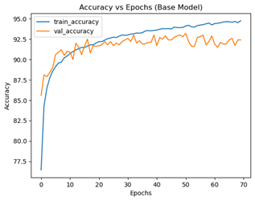

## Fashion-MNIST Classification Project Summary

### **Project Overview**

Developed advanced CNN models using PyTorch to classify images from the Fashion-MNIST dataset, achieving high accuracy and demonstrating deep learning competency.

### **Achievements**

- Attained over **92% accuracy** on the Fashion-MNIST test dataset.
- Implemented two distinct CNN models: a **Base Model** (architecture specified by assignment), and an **Enhanced Model** (architecture designed by myself), with significant enhancements leading to improved performance.

### **Base Model Insights**

- **Architecture**: Comprised convolutional layers, ReLU activations, and max-pooling, followed by dense layers for classification. Adam optimizer is also used in base model to enhance training performance.
- **Performance**: Provided a solid foundation with robust classification capabilities, serving as a benchmark for further optimizations.

### **Enhanced Model Enhancements Made**

- **Data Augmentation**: Added random vertical flips to the existing augmentation pipeline, enriching the model's exposure to diverse data patterns.
- **Batch Normalization**: Incorporated batch normalization post-convolutional and dense layers, stabilizing training and accelerating convergence.
- **Dropout**: Integrated a dropout layer to reduce overfitting, making the model more generalizable to unseen data.
- **Network Architecture**: Increased depth and width of the network, allowing it to capture more complex features and improve accuracy.

### **Quantitative Improvements**

- The **Base Model** achieved an initial test accuracy of **91.65%**.
- The **Enhanced Model** significantly outperformed the base, with a test accuracy of **92.68%**, marking a **1.03% improvement**.

### **Benchmark Comparison**

- Compared to the CNN benchmarks provided by the lecturer, the Enhanced Model showed superior accuracy, highlighting effective model optimization.
- While the Enhanced Model did not outperform complex architectures like ResNet18, it demonstrated competitive efficiency and performance, making it a viable solution considering the balance between accuracy and computational resources.

#### **Base Model Performance**

Plots for demonstrating the base model's training and validation performance with respect to number of epochs

#### **Enhanced Model Performance**

Plots for demonstrating the Adjusted model’s (modified model’s) training and validation performance with respect to number of epochs

### **Conclusion**

This project underscores my understanding of deep learning, proficiency in applying deep learning techniques to tackle image classification challenges, showcasing the ability to iteratively enhance model performance. The strategic improvements implemented in the Enhanced Model not only boosted its accuracy but also provided valuable insights into the impact of various optimization techniques in deep learning.